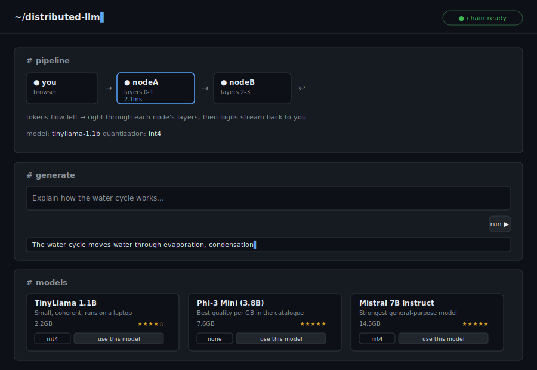
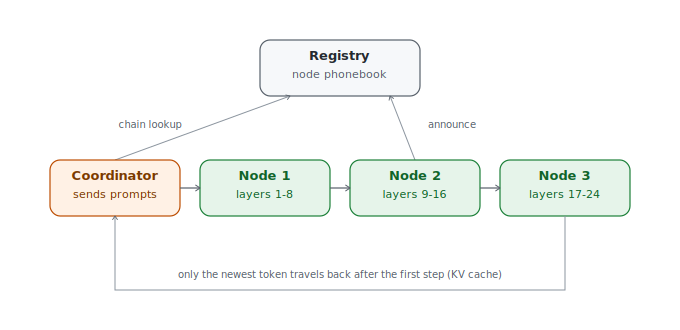

# Distributed LLM

[](LICENSE)


Split AI inference across multiple machines. Each machine runs a slice of the model, passes its result to the next, and together they generate text that none could run alone.

Built from scratch — custom transformer, TCP wire protocol, live registry, KV caching, quantization, and a web dashboard. The same core idea as [Petals](https://github.com/bigscience-workshop/petals), at a learnable scale: every piece here is plain, readable code you can trace end to end.

<p align="center">
  
</p>

<p align="center"><sub>Preview mockup of the web dashboard — see <a href="#screenshots">Screenshots</a> for details on how to add a real one.</sub></p>

## Contents

- [Quick start](#quick-start)
- [How it works](#how-it-works)
- [Two machines on the same wifi](#two-machines-on-the-same-wifi)
- [Downloading real AI models](#downloading-real-ai-models)
- [Quantization](#quantization)
- [KV caching](#kv-caching)
- [Lazy layer loading](#lazy-layer-loading)
- [Training the built-in model](#training-the-built-in-model)
- [Web dashboard](#web-dashboard)
- [Screenshots](#screenshots)
- [File guide](#file-guide)
- [Registry API](#registry-api)
- [Honest limitations](#honest-limitations)
- [What's next](#whats-next)
- [Contributing](#contributing)
- [License](#license)

---

## Quick start

```bash
pip install -r requirements.txt
python create_checkpoint.py   # run once
python run.py                 # interactive launcher
```

The launcher shows a live status view in the terminal — registry status, connected nodes, chain health — and guides you through everything else. (There's also a separate browser-based [web dashboard](#web-dashboard) with a visual pipeline view, covered further down.)

**Startup order:** Registry → Nodes → Client. Each in its own terminal.

---

## How it works

1. The **registry** is the network phonebook. Nodes announce on startup — either with a fixed layer range, or as an unassigned "pool" node waiting to be given one. The coordinator asks for the current live chain before each request.
2. Each **node** computes only its assigned layer range. For HuggingFace models it reads only those layers off disk (see Lazy layer loading below) rather than loading the whole checkpoint; it receives a tensor from the previous node, runs its layers, and forwards the result to the next.
3. The **coordinator** tokenises a prompt, sends it to the first node, and waits for logits to come back through the whole chain. The full prompt is only sent once — each subsequent token reuses the KV cache each node keeps locally, so only the newest token travels the chain from then on. Tokens are streamed to the terminal as they're generated.
4. **Hot reload** — run `python train.py` or `python download_model.py` at any time, or switch models from the web dashboard or `run.py`'s MODELS menu. Every node polls the registry for the current model and its own layer assignment, so a switch reaches nodes on *any* machine within a few seconds — not just ones sharing a disk with whoever made the change.

<p align="center">
  
</p>

---

## Two machines on the same wifi

The easy way — add nodes to a pool and let the launcher figure out the layer split:

1. Copy the whole folder (including `model.pt`) to both machines.
2. Start the registry on machine A.
3. On each machine, run `python run.py` → **3 NODE** → accept "pool" (the default) and the auto-detected LAN IP. The node announces itself and waits.
4. Once every node you want is running, go to `python run.py` → **5 MODELS** on any machine. It shows you every node currently online and **waits for you to explicitly confirm that list** before doing anything — start any remaining nodes now, or refresh the list, then type `go`. Only after that does it recommend a model, split its layers evenly across every one of those confirmed nodes, and push the split — no manual layer-range math, no restart.
5. Run the client from any machine.

Prefer to pick exact layer ranges yourself? Choose "manual" instead of "pool" in step 3 and enter `--start`/`--end` directly. Note that the next time you download/switch a model through step 4, that node gets re-split along with everyone else — the MODELS flow always re-provisions every currently-confirmed node fresh for whichever model you pick, rather than only touching unassigned ones.

**Firewall:** Windows will prompt to allow the port — click Allow. On the same local network, no router config is needed. For machines on different networks, [Tailscale](https://tailscale.com) (free) makes them act like they're on the same LAN. Each node auto-detects its own LAN IP to advertise to the registry; override it with `--host` if the detected one is wrong (e.g. a machine with multiple network interfaces).

---

## Downloading real AI models

```bash
python run.py   # → 5 MODELS
```

The model manager shows you the network's current node list and **waits for an explicit confirmation** before it does anything — add or start any remaining nodes, refresh the list, then confirm. Only then does it benchmark, recommend models that fit, and download across every confirmed node simultaneously (splitting each model's layers evenly across *all* of them, not just newly-added ones). Switching to a new model hot-reloads into running nodes automatically. The web dashboard's Models panel has the same confirm-your-nodes step before its "use this model" buttons unlock.

**Each node only downloads its own layers.** Once a node knows its layer range (from the confirm-and-split step above, or manual `--start`/`--end`), it fetches just the shard files containing those layers instead of the whole checkpoint — for a 40-shard model where a node owns 2 of 32 layers, that's typically 2-3 files, not 40. This uses the same shard index every sharded HuggingFace checkpoint already ships with, so it needs no extra setup. Falls back automatically (same result, just a bigger download) for single-file checkpoints, architectures lazy loading doesn't cover, or anything unexpected in the shard-selection step — check a node's own terminal for `(layers only)` vs `(full checkpoint)` in its download log to see which happened.

**Supported model families:** GPT-2 (all sizes), DistilGPT-2, GPT-Neo, OPT, TinyLlama, Phi-3, Mistral.

**Recommended starting point:** TinyLlama 1.1B — 2.2 GB download, runs on a single laptop with 4GB+ RAM, produces genuinely coherent output. Far better than any GPT-2 variant at the same size.

**Heavier options:** Phi-3 Mini (3.8B) and Mistral 7B Instruct are the highest-quality models in the catalogue. They're large enough that the model manager will only recommend them once you have enough nodes/RAM, or a GPU node with quantization enabled (see below).

---

## Quantization

Any model flagged quantizable in the catalogue can be loaded in int8 or int4 via [bitsandbytes](https://github.com/bitsandbytes-foundation/bitsandbytes) instead of full precision — roughly 2x or 4x less RAM per node, at some quality cost for int4.

```bash
python download_model.py --switch mistral-7b --quant int4
```

The model manager (`5 MODELS` in the launcher) also asks for a quantization level when you pick a model, and recommends one automatically if a model only fits your network at a reduced precision.

**Requirements:** quantization needs a CUDA GPU on whichever node loads that layer range, plus `bitsandbytes` and `accelerate` (both in `requirements.txt`). Nodes without a GPU fall back to full precision automatically and print a warning — they won't crash, they'll just use more RAM than expected. Quantization is applied at load time from the same downloaded checkpoint, so there's no separate download step.

---

## KV caching

Every node now keeps its own local cache of keys/values for each in-flight request. The prompt is processed once; after that, only the single newest token's hidden state travels between nodes instead of the whole growing sequence — much less network traffic and no more recomputing attention over tokens that were already processed.

This is on by default (works for TinyGPT and every HuggingFace family in the catalogue). To compare against the old always-recompute behavior:

```bash
python coordinator/client.py "your prompt" --no-cache
```

**How it stays correct:** each node's cache is local to that process and keyed by a per-request id the coordinator generates — caches never travel over the wire, only the new token's hidden state does. A request's cache is freed the moment generation ends (EOS, max tokens, or the context window is reached); an idle-timeout sweeper also clears anything left behind by a crashed or interrupted client after 10 minutes. Hot-reloading the model (switching models, or a new checkpoint from `train.py`) clears every in-flight cache immediately, since old cached keys/values are meaningless once the weights change.

**Context window:** because positions are cached incrementally rather than recomputed, generation now stops cleanly once the model's context window (`block_size`) is reached, instead of silently sliding a window over the prompt. You'll see a `[stopped: reached this model's N-token context window]` message if that happens.

---

## Lazy layer loading

Each node used to load the **entire** downloaded checkpoint into memory, then keep only the layers it's actually responsible for and discard the rest. That works, but it means a node holding 2 of a model's 32 layers still needed enough RAM to momentarily hold all 32 — which undercuts the whole idea of spreading a big model across weak devices.

Nodes now read **only their own layers** straight off disk instead. For a 16-layer model split so one node owns 2 layers, that node materializes roughly 13% of the checkpoint's weights, not 100% of them — verified directly (not just by inspection): a real 16-layer/730MB test model loaded in full is 730MB of real tensors; the same model loaded for a 2-layer node is ~94MB of real tensors, with the rest genuinely never read off disk.

This is on automatically — no flag to set. It applies to full-precision loads of GPT-2, OPT, and Llama-family models (Llama/TinyLlama/Mistral/Phi-3) when the checkpoint is in `.safetensors` format (standard for any model published on the Hub in the last couple of years, single-file or sharded). If a checkpoint predates safetensors, or an architecture isn't one of the three above, or quantization is active, it falls back to the original full-load-then-slice behavior automatically — same result, just more RAM used during load. A note in the node's log says which path was taken.

**Deliberately out of scope for now:** combining this with quantization. Bitsandbytes needs to control exactly how a layer's weights get packed, not just where they're read from, and doing that safely on hand-picked tensors is a meaningfully different (and riskier) piece of work than what's here. Quantized loads still use the full-load path — though if quantization silently falls back to full precision (no GPU available), lazy loading still kicks in for that fallback.

---

## Training the built-in model

The default `model.pt` has random weights (output is noise). To teach it real language:

```bash
python train.py --data data/sample.txt --steps 1500
```

Use a bigger text file for much better results. Any plain-text file works — public domain books from [gutenberg.org](https://www.gutenberg.org) are ideal. 500KB+ of text with 3000+ steps will produce recognisable word patterns.

Running nodes pick up the new weights automatically.

---

## Web dashboard

A browser view of the network — the live pipeline as tokens flow through it, and model switching/downloading/quantization without touching the terminal.

```bash
python dashboard/server.py
# then open http://127.0.0.1:7000
```

Or from the launcher: `python run.py` → `6 DASHBOARD`.

- **Pipeline panel** — every registered node, live online/offline status, and a real-time highlight that travels node-to-node as each token is generated, labeled with that node's actual compute time for that step (not simulated — it's the same per-node timing the CLI prints).
- **Generate panel** — a prompt box that runs a real generation through the network and streams the output.
- **Models panel** — every catalogue entry as a card with a quantization dropdown and a "use this model" button, which triggers the same distributed-download-then-switch flow as `download_model.py`, with live progress per node.

It talks to the registry and each node's existing management port exactly the way `download_model.py` and `coordinator/client.py` already do — it can't start or stop node processes, only switch which model they load. Like the rest of the network, it binds to all interfaces so it's reachable from other devices on your wifi; don't expose it to the open internet.

---

## Screenshots

The dashboard preview above and the architecture diagram in "How it works" are **SVGs built to match the real CSS and layout exactly** (colors, fonts, panel structure) — not live screenshots. There's no display available in the environment these were built in to capture an actual browser or terminal session.

If you'd like to swap in the real thing once you've got it running:

1. Start the full stack (`python run.py` → registry, a couple of nodes, the dashboard) and run a generation.
2. Screenshot the browser window at `http://127.0.0.1:7000` and the terminal launcher (`python run.py`'s own live status view).
3. Drop them in `docs/` (e.g. `docs/dashboard.png`, `docs/launcher.png`) and swap the `` paths above to point at them.

A terminal recording (via [asciinema](https://asciinema.org) or [termtosvg](https://github.com/nbedos/termtosvg)) of a full `run.py` → node → client session would also be a nice addition here for anyone browsing the repo before cloning it.

---

## File guide

| File | Purpose |
|---|---|
| `run.py` | Terminal live status view + interactive launcher for all options |
| `registry/server.py` | HTTP phonebook — nodes announce here, coordinator queries here |
| `node/server.py` | Node agent — loads model slice, serves inference, keeps each request's KV cache, hot-reloads |
| `coordinator/client.py` | Sends prompts, streams output, drives the prefill-then-single-token cached generation loop, prints per-node timing |
| `download_model.py` | Benchmark → recommend → distributed download → switch model |
| `dashboard/server.py` | Web dashboard — live pipeline view, model switching/download over HTTP |
| `dashboard/static/index.html` | Dashboard frontend — single-file HTML/CSS/JS, no build step |
| `setup_wizard.py` | First-time guided setup with firewall configuration |
| `train.py` | Train the built-in model on a text file |
| `create_checkpoint.py` | Create a fresh random-weight checkpoint |
| `models/catalogue.py` | List of downloadable models with hardware requirements |
| `models/hf_wrapper.py` | Adapter that makes HuggingFace models speak the node protocol; also resolves quantization |
| `models/lazy_loader.py` | Reads only a node's own layers off disk; also figures out which shard files to download in the first place |
| `shared/protocol.py` | Length-prefixed TCP wire format for sending tensors between nodes |
| `shared/netinfo.py` | LAN IP auto-detection, shared by node/server.py, run.py, and setup_wizard.py |
| `config.py` | Model shape and defaults |
| `ui.py` | Terminal colour helpers, box drawing, spinner |
| `docs/*.svg` | Architecture diagram and dashboard preview used in this README |
| `CONTRIBUTING.md` | Dev setup, good-first-issue tasks, PR checklist |

---

## Registry API

| Endpoint | Method | Description |
|---|---|---|
| `/announce` | POST | Node registers: `{host, port, label, hw_specs}`, plus `start_layer`/`end_layer` if it has an assignment (omit both to join as a pool node) |
| `/heartbeat` | POST | Node keepalive every 5s |
| `/chain` | GET | Ordered list of live, *assigned* nodes — 503 if layers have gaps |
| `/status` | GET | Every node (assigned and pool), alive/dead, requests served, hardware specs |
| `/network_specs` | GET | Hardware specs across all alive assigned nodes (used by recommender) |
| `/pool` | GET | Unassigned nodes waiting for a layer range + model |
| `/assignments` | GET/POST | Per-node (by label) layer ranges — nodes poll this to pick up a (re-)assignment |
| `/active_model` | GET/POST | The network-wide active model — nodes poll this so a switch reaches every machine, not just the one that made it |
| `/health` | GET | Liveness check |

---

## Honest limitations

**Central registry** — if the registry goes down, no new requests can be routed, pool nodes can't get an assignment, and model switches can't propagate to other machines. In-flight requests complete fine. A full peer-to-peer DHT (like Petals uses) would remove this single point of failure but is significantly more complex.

**No load balancing** — requests always go through the same linear chain. Two parallel requests queue up rather than being split across spare capacity.

**A node dying mid-generation stops that request, not the network** — if a node crashes or drops off mid-generation, the coordinator detects it quickly (seconds, not a hang) and returns whatever was generated so far with a clear note about what happened. It deliberately does *not* retry the same request automatically: with KV caching, an earlier node in the chain may have already committed a cache update for that step, so silently resending it risks double-applying a token. Start a fresh request (fresh caches everywhere) to continue.

**Each node downloads only its own shards, when the checkpoint is sharded and the architecture supports lazy loading** — otherwise it falls back to downloading the whole checkpoint (still correct, just no bandwidth savings on that specific model). See "Downloading real AI models" below.

**Lazy loading doesn't combine with quantization yet** — quantized loads still use the full-load-then-slice path (see the Lazy layer loading section above for why).

**KV cache is per-request, in-memory only** — it lives as long as the generation does and isn't persisted or shared across requests, so there's no prompt-prefix reuse between separate conversations yet.

**Pickle for tensor transport** — fine on a trusted local network; never expose node ports to the open internet.

---

## What's next

- Range-request partial downloads for single-file (non-sharded) checkpoints — smaller models that ship as one `model.safetensors` don't have per-shard granularity to exploit yet
- Prompt-prefix cache reuse across separate requests (e.g. a shared system prompt)
- Continuous batching — interleave multiple requests' token steps instead of queuing them
- Automatic rerouting around a dead node (a replacement node taking over its layer range) — failure is now detected cleanly, but the network doesn't yet route around it
- CPU-friendly quantization path (current int8/int4 support needs a CUDA GPU)
- Streaming HTTP API so other apps can use the network

---

## Contributing

Contributions welcome — see [CONTRIBUTING.md](CONTRIBUTING.md) for dev setup, a few good-first-issue-sized tasks, and what to check before opening a PR.

---

## License

[MIT](LICENSE) — do whatever you want with it.
